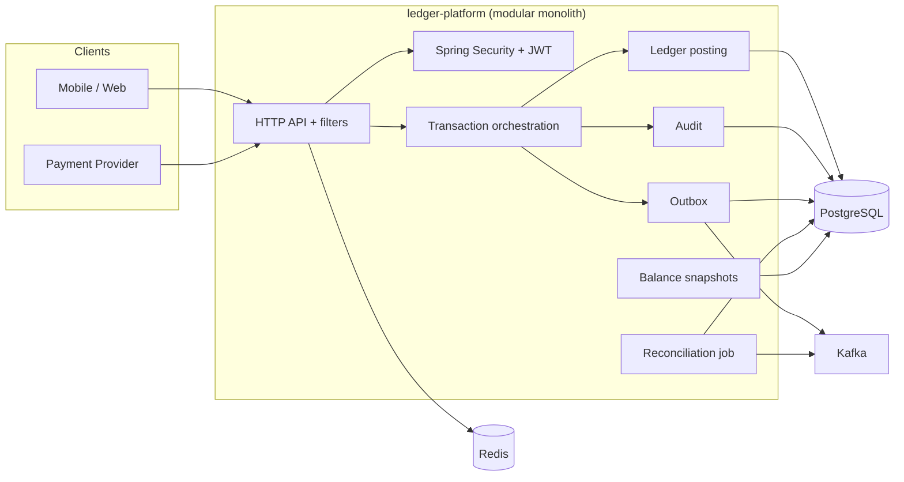
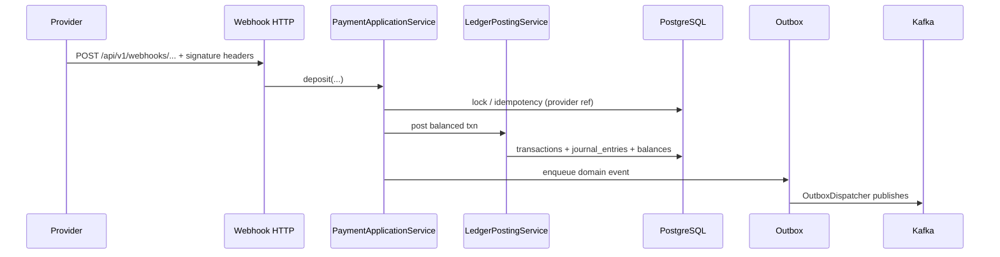
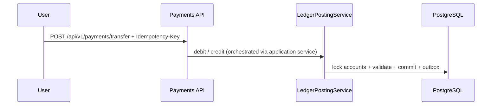

# Double-Entry Ledger Platform

A production-minded **modular monolith** for wallets and double-entry ledger flows in fintech and payments. The codebase splits domain, persistence, application services, and the HTTP adapter across Maven modules, using **Java 21**, **Spring Boot 3.4**, **PostgreSQL**, **Redis**, **Kafka**, **Flyway**, **OpenAPI (Swagger)**, and optional **Testcontainers**-based integration tests.

## Contents

- [Capabilities](#capabilities)
- [Technology stack](#technology-stack)
- [Repository layout](#repository-layout)
- [Quick start](#quick-start)
- [Configuration](#configuration)
- [HTTP API and documentation](#http-api-and-documentation)
- [Observability](#observability)
- [Architecture](#architecture)
- [Reference flows](#reference-flows)
- [Testing](#testing)
- [Integrity and operations](#integrity-and-operations)
- [License](#license)

## Capabilities

- **Double-entry posting** — Movements are balanced `journal_entries`; DB triggers enforce append-only behavior on the journal.
- **Idempotent commands** — Retries and duplicate provider references are deduplicated using idempotency keys and scoped advisory locks inside posting transactions.
- **Posting invariants** — Account locking (pessimistic where needed), balanced postings, and protections against invalid negative user-liability states.
- **Transactional outbox** — Events written to `outbox_messages` in the same transaction as the post, then published to Kafka (`OutboxDispatcher`).
- **Product flows** — P2P transfer, merchant payment (gross and platform fee), withdrawal (with optional maker/checker), reversal, and **deposit settlement** in `PaymentApplicationService` (typically called from a signed provider webhook; see [HTTP API](#http-api-and-documentation)).
- **Maker/checker withdrawals** — When `ledger.withdrawal.approval-threshold-minor` is set to a finite minor-unit amount, large withdrawals return `202 Accepted` with a pending approval id; users with `COMPLIANCE`, `OPERATIONS`, or `ADMIN` approve or reject via `/api/v1/approvals/...`.
- **Operational freeze** — `ADMIN` / `OPERATIONS` can freeze or unfreeze wallets and chart accounts under `/api/v1/admin/...`, with audit support in the service layer.
- **Rate limiting** — Redis-backed per-minute limits (`ledger.rate-limit.requests-per-minute`).
- **Tracing** — Optional OTLP export (`OTEL_EXPORTER_OTLP_ENABLED`, `OTEL_EXPORTER_OTLP_ENDPOINT`) via Micrometer and OpenTelemetry.

## Technology stack

| Area               | Choice                                                                                     |
| ------------------ | ------------------------------------------------------------------------------------------ |
| Language / runtime | Java 21 (Temurin in Docker)                                                                |
| Framework          | Spring Boot 3.4, Spring Security, Spring Data JPA, Spring Kafka                            |
| API docs           | springdoc-openapi (Swagger UI + OpenAPI 3 JSON)                                            |
| Database           | PostgreSQL 16 (Flyway migrations under `ledger-platform/src/main/resources/db/migration/`) |
| Cache / rate limit | Redis 7                                                                                    |
| Messaging          | Apache Kafka (Confluent 7.7 images in Compose; ZooKeeper for local dev)                    |
| Metrics            | Micrometer Prometheus registry; scrape via `monitoring/prometheus.yml`                     |
| Dashboards         | Grafana 11 (Compose)                                                                       |

## Repository layout

| Maven module         | Role                                                                                                                   |
| -------------------- | ---------------------------------------------------------------------------------------------------------------------- |
| `ledger-domain`      | Core types, enums, domain models                                                                                       |
| `ledger-persistence` | JPA entities, repositories, Flyway-backed schema assumptions                                                           |
| `ledger-core`        | Application services (posting, payments, wallet, outbox, reconciliation, auth helpers, webhook signature verification) |
| `ledger-platform`    | Spring Boot application packaging, REST controllers, security filter chain, OpenAPI config                             |

Logical packages (mainly under `ledger-core` and `ledger-platform`): `auth`, `wallet`, `ledger`, `transaction`, `messaging`, `reconciliation`, `audit`, `notification`, `admin`, `webhook`, `bonus` (scheduled snapshots), and `security`.

## Quick start

**Requirements:** JDK 21, Docker with Docker Compose v2.

From the repository root:

```bash
cd double-entry-ledger-platform
docker compose up --build
```

Compose waits for healthy **PostgreSQL**, **Redis**, and **Kafka** before starting **ledger-app**. On first connect the app runs **Flyway** migrations against the `ledger` database.

### URLs (local Compose)

| Service      | URL                                                                                                                                                                        | Notes                                         |
| ------------ | -------------------------------------------------------------------------------------------------------------------------------------------------------------------------- | --------------------------------------------- |
| HTTP API     | [http://localhost:8080](http://localhost:8080)                                                                                                                             | Default `SERVER_PORT` is 8080                 |
| Swagger UI   | [http://localhost:8080/api-docs](http://localhost:8080/api-docs) → redirect, or [http://localhost:8080/swagger-ui/index.html](http://localhost:8080/swagger-ui/index.html) |
| OpenAPI JSON | [http://localhost:8080/v3/api-docs](http://localhost:8080/v3/api-docs)                                                                                                     |
| Prometheus   | [http://localhost:9090](http://localhost:9090)                                                                                                                             | Scrapes `ledger-app:8080/actuator/prometheus` |
| Grafana      | [http://localhost:3000](http://localhost:3000)                                                                                                                             | Default login `admin` / `admin`               |

Kafka is available on the host at **localhost:9092** (broker advertised for host access; the app uses `kafka:29092` inside the Docker network per `docker-compose.yml`).

### Run with Maven (no Compose)

Start PostgreSQL, Redis, and Kafka yourself, export `JAVA_HOME` for JDK 21, then:

```bash
mvn -pl ledger-platform -am spring-boot:run
```

### Build the runtime image

```bash
docker build -f ledger-platform/Dockerfile -t ledger-platform:local .
```

The image runs `java -jar` on the repackaged Spring Boot JAR from `ledger-platform/target/`.

## Configuration

Primary settings live in [ledger-platform/src/main/resources/application.yml](ledger-platform/src/main/resources/application.yml). Compose passes through the most important variables for **ledger-app**:

| Variable                                                    | Purpose                                                                                                                                   |
| ----------------------------------------------------------- | ----------------------------------------------------------------------------------------------------------------------------------------- |
| `DB_HOST`, `DB_PORT`, `DB_NAME`, `DB_USER`, `DB_PASSWORD`   | PostgreSQL JDBC                                                                                                                           |
| `REDIS_HOST`, `REDIS_PORT`                                  | Redis connection                                                                                                                          |
| `KAFKA_BOOTSTRAP_SERVERS`                                   | Kafka clients (use `localhost:9092` on host, `kafka:29092` in Compose network)                                                            |
| `JWT_SECRET`                                                | Source string for HS256 signing key (hashed with SHA-256 in `JwtTokenService`)                                                            |
| `WEBHOOK_HMAC_SECRET`                                       | Shared secret for provider webhook HMAC (see below)                                                                                       |
| `SERVER_PORT`                                               | HTTP port (default 8080)                                                                                                                  |
| `RATE_LIMIT_RPM`                                            | Requests per minute per key (default 120)                                                                                                 |
| `WITHDRAWAL_APPROVAL_THRESHOLD_MINOR`                       | Above this minor-unit amount, withdrawals require approval (default `Long.MAX_VALUE` disables the workflow; try e.g. `5000000` to enable) |
| `OTEL_EXPORTER_OTLP_ENABLED`, `OTEL_EXPORTER_OTLP_ENDPOINT` | Optional tracing export                                                                                                                   |

Topic names and other ledger-specific toggles are under the `ledger.*` prefix in `application.yml`.

## HTTP API and documentation

Interactive documentation is served by **springdoc-openapi**. Use **Authorize** in Swagger with a `Bearer` JWT after obtaining a token from your login/register endpoint (see `AuthService` and security rules in `ledger-platform`).

**Implemented REST surface** (all JSON, JWT unless noted):

| Method | Path                                          | Description                                                       |
| ------ | --------------------------------------------- | ----------------------------------------------------------------- |
| `POST` | `/api/v1/payments/transfer`                   | P2P transfer (`Idempotency-Key` supported via service layer)      |
| `POST` | `/api/v1/payments/merchant`                   | Merchant payment with fee split                                   |
| `POST` | `/api/v1/payments/withdraw`                   | Withdrawal; may return `202` + approval id when threshold applies |
| `POST` | `/api/v1/payments/reverse`                    | Reversal of a prior transaction                                   |
| `POST` | `/api/v1/approvals/{id}/approve`              | Approve pending withdrawal (`COMPLIANCE`, `OPERATIONS`, `ADMIN`)  |
| `POST` | `/api/v1/approvals/{id}/reject`               | Reject pending withdrawal (same roles)                            |
| `POST` | `/api/v1/admin/wallets/{walletId}/freeze`     | Freeze wallet (`ADMIN`, `OPERATIONS`)                             |
| `POST` | `/api/v1/admin/wallets/{walletId}/unfreeze`   | Unfreeze wallet                                                   |
| `POST` | `/api/v1/admin/accounts/{accountId}/freeze`   | Freeze ledger account                                             |
| `POST` | `/api/v1/admin/accounts/{accountId}/unfreeze` | Unfreeze ledger account                                           |
| `GET`  | `/api-docs`                                   | Redirect to Swagger UI                                            |

Spring Security **permits unauthenticated** access to `/api/v1/auth/**` and `/api/v1/webhooks/**` so you can expose registration, login, and signed deposit webhooks without a JWT. The application service **`PaymentApplicationService.deposit`** implements provider-backed deposits; wire it from a webhook controller that validates signatures with [WebhookSignatureVerifier](ledger-core/src/main/java/com/fintech/ledger/webhook/WebhookSignatureVerifier.java). That component computes **hex-encoded HMAC-SHA256** of the **raw request body** using `ledger.webhook.hmac-secret` (`WEBHOOK_HMAC_SECRET`) and compares it to the provided hex signature in **constant time**. Choose an HTTP header (for example `X-Signature`) in your controller and pass the raw body plus the header value into `isValid`.

**Actuator** (partially protected): health and Prometheus are open for scrape compatibility; see `SecurityConfig` for the precise matcher list.

## Observability

- **Metrics:** `GET /actuator/prometheus` (Prometheus in Compose scrapes `ledger-app:8080`).
- **Health:** `GET /actuator/health`, `GET /actuator/info`.
- **Traces:** Enable OTLP export via env vars; default OTLP endpoint in config is `http://localhost:4318/v1/traces`.

## Architecture



## Reference flows

### Deposit (provider webhook)



### Wallet transfer



## Testing

```bash
# Unit tests (all modules)
mvn test

# Package + integration tests when ITs are present (Docker required for Testcontainers)
mvn -pl ledger-platform verify
```

Example unit test: `ledger-core/src/test/java/com/fintech/ledger/ledger/BalanceMathTest.java`. Integration tests, when added under `ledger-platform`, typically use `@Testcontainers` with `disabledWithoutDocker = true` so CI can skip them if Docker is unavailable.

## Integrity and operations

- **Journal immutability** — Database triggers prevent `UPDATE`/`DELETE` on `journal_entries` (verify in Flyway migrations).
- **Webhook security** — Use strong secrets, rotate `WEBHOOK_HMAC_SECRET`, and reject requests with missing or invalid signatures.
- **Idempotency** — Send stable `Idempotency-Key` (and correlation ids) on client-initiated payments; provider references must be unique per provider for deposits.
- **Deadlock avoidance** — Posting acquires account locks in a deterministic order when multiple accounts participate.
- **Production checklist** — Short-lived JWTs, secrets in a vault or KMS, network policy between PSPs and webhooks, separate read models if needed, reconciliation alerting on `ledger.reconciliation.mismatch`, and shipping audit logs to your SIEM.

### Scheduled jobs

- **Reconciliation** — Cron from `ledger.reconciliation.cron` in `application.yml`.
- **Balance snapshots** — `BalanceSnapshotJob` (`ledger.snapshot.cron`) maintains `ledger_balance_snapshots` for selected clearing accounts.

Seeded chart-of-account and system-wallet data includes **USD** and **EUR** (see `V2__seed_roles_and_accounts.sql`).

## License

Proprietary / internal — adjust to match your organization.
